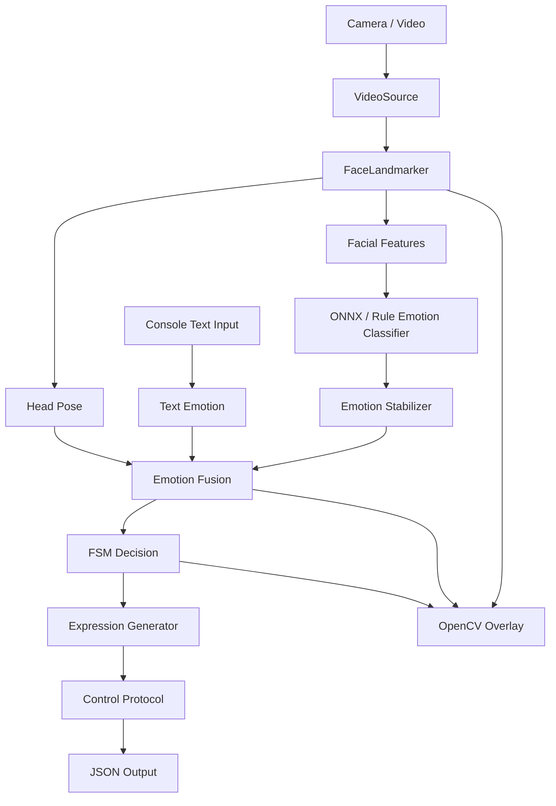

# Face Expression Interaction

基于摄像头/视频输入的仿生机器人表情交互控制 Demo。项目通过 MediaPipe Tasks 提取人脸关键点，结合 ONNX 视觉情绪模型、文本情绪输入、情绪稳定层和 FSM 决策，最终输出面向机器人表情控制的 JSON 协议。

主链路：

```text
camera/video -> face landmarks -> facial features -> emotion classification
-> emotion stabilization -> multimodal fusion -> FSM decision
-> expression command -> JSON control payload
```

## 核心能力

- 支持摄像头实时输入和本地视频输入。
- 支持 MediaPipe FaceLandmarker 人脸关键点检测。
- 支持头部姿态、嘴巴、眼睛、眉毛等表情特征提取。
- 支持 ONNX 视觉情绪识别，并保留规则情绪识别作为 fallback。
- 支持情绪稳定层，降低单帧情绪跳变对机器人状态的影响。
- 支持中文文本情绪输入，与视觉情绪和头部姿态进行融合。
- 支持 FSM 机器人状态决策，输出表情策略和强度。
- 支持 JSON 控制协议输出，包含虚拟舵机参数。
- 支持 Windows 一键部署、一键运行和跨平台 Python 入口。

## 完整业务链路



链路中的每一步都把数据抽象提升一层：图像帧先转为人脸结构，再转为表情特征和情绪结果，随后融合成用户状态，最后转为机器人状态、表情参数和控制协议。

## 架构分层

| 层级 | 目录/文件 | 职责 |
| --- | --- | --- |
| 启动装配层 | `main.py` | 读取配置、解析参数、创建模块并注入 Pipeline |
| 应用编排层 | `app/pipeline.py` | 编排单帧处理链路和资源释放 |
| 输入层 | `input/` | 读取摄像头/视频帧和异步文本输入 |
| 感知层 | `perception/` | 调用 MediaPipe FaceLandmarker，输出人脸关键点和头部姿态 |
| 特征层 | `features/` | 从关键点计算嘴巴、眼睛、眉毛和头部姿态特征 |
| 情绪层 | `emotion/` | 视觉情绪识别、文本情绪识别、情绪稳定和多模态融合 |
| 决策层 | `decision/` | 将用户状态映射为机器人状态和表情策略 |
| 表情层 | `expression/` | 将表情策略转为强度、持续时间和虚拟舵机参数 |
| 控制层 | `control/` | 生成 JSON 控制协议 |
| 展示层 | `demo/` | OpenCV 窗口显示、状态叠加和退出控制 |

## 核心数据流

主要数据对象定义在 `core/data_structures.py`：

```text
FrameInput
  -> FaceLandmarkResult
  -> HeadPose + FacialFeatures
  -> EmotionClassificationResult
  -> EmotionResult
  -> DecisionResult
  -> ExpressionCommand
  -> ControlCommand
```

这些数据对象是模块边界。感知层不直接决定机器人动作，模型层不直接生成舵机参数，控制层也不关心情绪如何识别。

## 情绪识别与稳定

默认配置使用 ONNX 视觉情绪模型：

```json
{
  "emotion": {
    "face_backend": "onnx",
    "fallback_to_rule": true,
    "onnx": {
      "model_path": "models/emotion.onnx",
      "input_type": "face_image",
      "image_size": [224, 224],
      "color_mode": "rgb",
      "labels": [
        "neutral",
        "happiness",
        "surprise",
        "sadness",
        "anger",
        "disgust",
        "fear",
        "contempt"
      ]
    }
  }
}
```

当 ONNXRuntime 或模型文件不可用时，`fallback_to_rule` 会切换到规则情绪识别。

模型输出会经过稳定层：

```json
{
  "stabilizer": {
    "enabled": true,
    "window_size": 7,
    "min_votes": 4,
    "min_confidence": 0.45,
    "reset_on_no_face": true
  }
}
```

稳定层使用滑动窗口投票和置信度阈值，避免单帧模型结果直接触发机器人状态切换。

## 决策与控制

情绪融合层输出 `user_state`，FSM 再映射为机器人状态和表情策略：

| 用户状态 | 机器人状态 | 表情策略 |
| --- | --- | --- |
| `no_face` | `idle` | `idle_blink` |
| `neutral` | `listening` | `neutral_listen` |
| `happy` | `happy_reply` | `happy_smile` |
| `sad` | `comforting` | `gentle_care` |
| `tired` | `comforting` | `soft_care` |
| `surprise` | `curious` | `curious_open_eye` |
| `angry` | `calming` | `neutral_listen` |

最终 JSON 示例：

```json
{
  "protocol_version": "1.0",
  "cmd": "set_expression",
  "robot_state": "comforting",
  "expression": "gentle_care",
  "intensity": 0.45,
  "duration_ms": 1500,
  "transition_ms": 400,
  "servo_params": {
    "eye_open": 65,
    "mouth_left": 35,
    "mouth_right": 35,
    "eyebrow_left": 20,
    "eyebrow_right": 20,
    "head_pitch": -8,
    "head_yaw": 0
  },
  "emotion_backend": "onnx",
  "raw_face_emotion": "sadness",
  "stable_face_emotion": "sad",
  "text_emotion": "neutral",
  "user_state": "sad"
}
```

## 线程模型

项目主体是单进程 Demo：

```text
Main Thread
  -> OpenCV 取帧
  -> 人脸检测
  -> 特征提取
  -> 情绪识别
  -> 决策与输出
  -> OpenCV 展示

Text Input Thread
  -> 阻塞读取控制台文本
  -> 使用锁更新最新文本状态
```

图像链路保持在主线程中顺序执行，文本输入放在后台 daemon 线程中，避免控制台输入阻塞视频处理。

## 目录结构

```text
.
├── app/                  # Pipeline 编排
├── config/               # 默认配置
├── control/              # JSON 控制协议
├── core/                 # 数据结构、配置和日志
├── decision/             # FSM 与表情策略
├── demo/                 # OpenCV 展示
├── emotion/              # 情绪识别、稳定和融合
├── expression/           # 表情参数生成
├── features/             # 表情特征提取和平滑
├── input/                # 摄像头/视频/文本输入
├── models/               # 默认 Demo 模型
├── perception/           # 人脸关键点和头部姿态
├── scripts/              # 部署、下载模型和运行入口
├── tests/                # 单元测试和集成测试
├── main.py               # 程序入口
├── deploy.bat / run.bat  # Windows 一键入口
└── deploy.sh / run.sh    # Linux / macOS 一键入口
```

## 环境准备

推荐使用项目外部 Python 环境，避免把虚拟环境放进仓库。

Windows 一键部署：

```bat
deploy.bat
```

Linux / macOS 一键部署：

```bash
./deploy.sh
```

跨平台 Python 入口：

```bash
python scripts/bootstrap.py
```

手动安装：

```bash
python -m pip install -r requirements.txt
python -m pip install -r requirements-model.txt
```

PyTorch 仅用于训练、导出或实验，不是 Demo 运行必需项：

```bash
python -m pip install -r requirements-torch.txt
```

## 模型文件

仓库随代码提供默认 Demo 模型：

```text
models/face_landmarker.task
models/emotion.onnx
```

模型缺失或需要刷新时：

```bash
python scripts/download_models.py
```

模型来源和许可说明见 `models/README.md` 与 `THIRD_PARTY_NOTICES.md`。

## 运行

Windows 摄像头 Demo：

```bat
run.bat
```

Windows 视频 Demo：

```bat
run_video.bat
```

Linux / macOS 摄像头 Demo：

```bash
./run.sh
```

通用运行脚本：

```bash
python scripts/run_demo.py --source camera --camera-id 0
python scripts/run_demo.py --source video --video-path samples/smoke_no_face.mp4
```

短跑验证：

```bash
python scripts/run_demo.py --source camera --camera-id 0 --max-frames 60
python scripts/run_demo.py --source video --video-path samples/smoke_no_face.mp4 --max-frames 3
```

运行时可在控制台输入中文文本，例如：

```text
开心
有点累
伤心
生气
```

OpenCV 窗口按 `q` 或 `Esc` 退出。

## 验证

```bash
python -m pytest -q
python -m ruff check .
```

当前测试覆盖配置加载、数据结构、输入源、人脸检测接口、头部姿态、特征提取、情绪分类、情绪稳定、融合决策、控制协议和 Pipeline 集成流程。

## 主要技术实现

- 图像采集与展示：OpenCV
- 人脸关键点：MediaPipe Tasks FaceLandmarker
- 视觉情绪模型：ONNXRuntime
- 数据处理：NumPy
- 决策逻辑：FSM + 策略表
- 控制输出：JSON 协议
- 测试与检查：pytest、ruff

## 配置入口

主要配置集中在 `config/default.json`：

```text
source / camera_id / video_path
face_detector.model_path
emotion.face_backend
emotion.onnx.model_path
emotion.stabilizer
decision.stable_frames
control.default_duration_ms
demo.draw_landmarks / draw_fps / draw_status
```

通过配置可以切换输入源、情绪识别 backend、稳定层参数、FSM 防抖帧数和展示选项。
